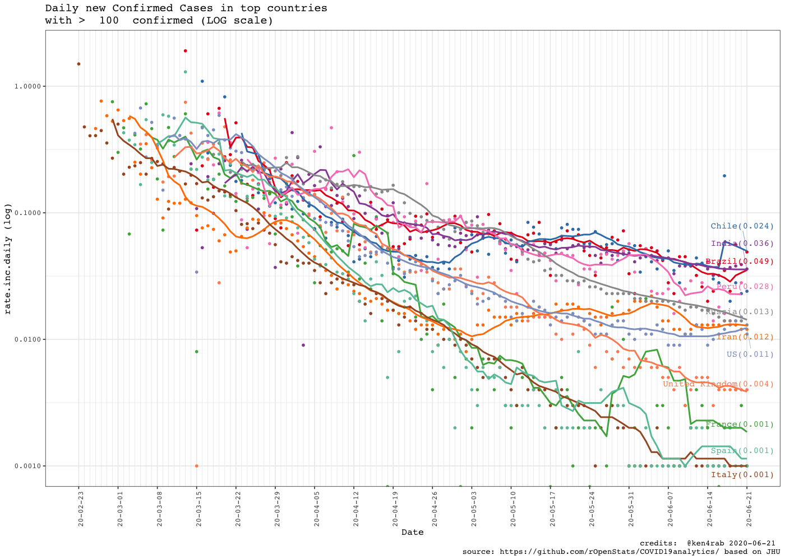

<!-- README.md is generated from README.Rmd. Please edit that file -->

# COVID19analytics

<!-- . -->

This package curate (downloads, clean, consolidate, smooth) [data from
Johns Hokpins](https://github.com/CSSEGISandData/COVID-19/) for
analysing international outbreak of COVID-19.

It includes several visualizations of the COVID-19 international
outbreak.

Yanchang Zhao, COVID-19 Data Analysis with Tidyverse and Ggplot2 -
China. RDataMining.com, 2020.

URL:
<http://www.rdatamining.com/docs/Coronavirus-data-analysis-china.pdf>.

  - COVID19DataProcessor generates curated series
  - [visualizations](https://www.r-bloggers.com/coronavirus-data-analysis-with-r-tidyverse-and-ggplot2/)
    by [Yanchang Zhao](https://www.r-bloggers.com/author/yanchang-zhao/)
    are included in ReportGenerator R6 object
  - More visualizations included int ReportGeneratorEnhanced R6 object
  - Visualizations ReportGeneratorDataComparison compares all countries
    counting epidemy day 0 when confirmed cases \> n (i.e. n = 100).

# Consideration

Data is still noisy because there are missing data from some regions in
some days. We are working on in it.

# Package

<!-- badges: start -->

| Release                                                                                                              | Usage                                                                                                    | Development                                                                                                                                                                                            |
| :------------------------------------------------------------------------------------------------------------------- | :------------------------------------------------------------------------------------------------------- | :----------------------------------------------------------------------------------------------------------------------------------------------------------------------------------------------------- |
|                                                                                                                      | [](https://cran.r-project.org/) | [](https://travis-ci.org/rOpenStats/COVID19analytics)                                                                    |
| [](https://cran.r-project.org/package=COVID19analytics) |                                                                                                          | [](https://codecov.io/gh/rOpenStats/COVID19analytics)                                                       |
|                                                                                                                      |                                                                                                          | [](https://www.repostatus.org/#active) |

<!-- badges: end -->

# How to get started (Development version)

Install the R package using the following commands on the R console:

``` r
# install.packages("devtools")
devtools::install_github("rOpenStats/COVID19analytics", build_opts = NULL)
```

# How to use it

``` r
library(COVID19analytics) 
#> Warning: replacing previous import 'ggplot2::Layout' by 'lgr::Layout' when
#> loading 'COVID19analytics'
#> Warning: replacing previous import 'readr::col_factor' by 'scales::col_factor'
#> when loading 'COVID19analytics'
#> Warning: replacing previous import 'magrittr::equals' by 'testthat::equals' when
#> loading 'COVID19analytics'
#> Warning: replacing previous import 'magrittr::not' by 'testthat::not' when
#> loading 'COVID19analytics'
#> Warning: replacing previous import 'magrittr::is_less_than' by
#> 'testthat::is_less_than' when loading 'COVID19analytics'
#> Warning: replacing previous import 'dplyr::matches' by 'testthat::matches' when
#> loading 'COVID19analytics'
#> Warning: replacing previous import 'testthat::matches' by 'tidyr::matches' when
#> loading 'COVID19analytics'
#> Warning: replacing previous import 'magrittr::extract' by 'tidyr::extract' when
#> loading 'COVID19analytics'
library(dplyr) 
#> 
#> Attaching package: 'dplyr'
#> The following objects are masked from 'package:stats':
#> 
#>     filter, lag
#> The following objects are masked from 'package:base':
#> 
#>     intersect, setdiff, setequal, union
```

``` r
data.processor <- COVID19DataProcessor$new(provider = "JohnsHopkingsUniversity", missing.values = "imputation")

#dummy <- data.processor$preprocess() is setupData + transform is the preprocess made by data provider
dummy <- data.processor$setupData()
#> INFO  [12:07:37.399]  {stage: processor-setup}
#> INFO  [12:07:37.443] Checking required downloaded  {downloaded.max.date: 2020-06-21, daily.update.time: 21:00:00, current.datetime: 2020-06-22 1.., download.flag: FALSE}
#> INFO  [12:07:37.573] Checking required downloaded  {downloaded.max.date: 2020-06-21, daily.update.time: 21:00:00, current.datetime: 2020-06-22 1.., download.flag: FALSE}
#> INFO  [12:07:37.600] Checking required downloaded  {downloaded.max.date: 2020-06-21, daily.update.time: 21:00:00, current.datetime: 2020-06-22 1.., download.flag: FALSE}
#> INFO  [12:07:37.749]  {stage: data loaded}
#> INFO  [12:07:37.751]  {stage: data-setup}
dummy <- data.processor$transform()
#> INFO  [12:07:37.753] Executing transform 
#> INFO  [12:07:37.754] Executing consolidate 
#> INFO  [12:07:39.700]  {stage: consolidated}
#> INFO  [12:07:39.701] Executing standarize 
#> INFO  [12:07:40.233] gathering DataModel 
#> INFO  [12:07:40.234]  {stage: datamodel-setup}
# Curate is the process made by missing values method
dummy <- data.processor$curate()
#> INFO  [12:07:40.238]  {stage: loading-aggregated-data-model}
#> Warning in countrycode(x, origin = "country.name", destination = "continent"): Some values were not matched unambiguously: MS Zaandam
#> INFO  [12:07:42.061]  {stage: calculating-rates}
#> INFO  [12:07:42.281]  {stage: making-data-comparison}
#> INFO  [12:07:48.778]  {stage: applying-missing-values-method}
#> INFO  [12:07:48.779]  {stage: Starting first imputation}
#> INFO  [12:07:48.789]  {stage: calculating-rates}
#> INFO  [12:07:49.033]  {stage: making-data-comparison-2}
#> INFO  [12:07:55.262]  {stage: calculating-top-countries}
#> INFO  [12:07:55.289]  {stage: curated}

current.date <- max(data.processor$getData()$date)

rg <- ReportGeneratorEnhanced$new(data.processor)
rc <- ReportGeneratorDataComparison$new(data.processor = data.processor)


top.countries <- data.processor$top.countries
international.countries <- unique(c(data.processor$top.countries,
                                    "Japan", "Singapore", "Korea, South"))
africa.countries <- sort(data.processor$countries$getCountries(division = "continent", name = "Africa"))
```

``` r
# Top 10 daily cases confirmed increment
(data.processor$getData() %>%
  filter(date == current.date) %>%
  select(country, date, rate.inc.daily, confirmed.inc, confirmed, deaths, deaths.inc) %>%
  arrange(desc(confirmed.inc)) %>%
  filter(confirmed >=10))[1:10,]
#> # A tibble: 10 x 7
#> # Groups:   country [10]
#>    country   date       rate.inc.daily confirmed.inc confirmed deaths deaths.inc
#>    <chr>     <date>              <dbl>         <int>     <int>  <int>      <int>
#>  1 Brazil    2020-06-21          0.049         50428   1083341  50591        615
#>  2 US        2020-06-21          0.011         24760   2279879 119969        250
#>  3 India     2020-06-21          0.036         14831    425282  13699        445
#>  4 Russia    2020-06-21          0.013          7717    583879   8101        109
#>  5 Chile     2020-06-21          0.024          5607    242355   4479        184
#>  6 Colombia  2020-06-21          0.085          5382     68836   2353        205
#>  7 Mexico    2020-06-21          0.03           5343    180545  21825       1044
#>  8 South Af… 2020-06-21          0.05           4621     97302   1930         53
#>  9 Pakistan  2020-06-21          0.025          4471    181088   3590         89
#> 10 Banglade… 2020-06-21          0.032          3531    112306   1464         39
```

``` r
# Top 10 daily deaths increment
(data.processor$getData() %>%
  filter(date == current.date) %>%
  select(country, date, rate.inc.daily, confirmed.inc, confirmed, deaths, deaths.inc) %>%
  arrange(desc(deaths.inc)))[1:10,]
#> # A tibble: 10 x 7
#> # Groups:   country [10]
#>    country  date       rate.inc.daily confirmed.inc confirmed deaths deaths.inc
#>    <chr>    <date>              <dbl>         <int>     <int>  <int>      <int>
#>  1 Mexico   2020-06-21          0.03           5343    180545  21825       1044
#>  2 Brazil   2020-06-21          0.049         50428   1083341  50591        615
#>  3 India    2020-06-21          0.036         14831    425282  13699        445
#>  4 US       2020-06-21          0.011         24760   2279879 119969        250
#>  5 Colombia 2020-06-21          0.085          5382     68836   2353        205
#>  6 Chile    2020-06-21          0.024          5607    242355   4479        184
#>  7 Iran     2020-06-21          0.012          2368    204952   9623        116
#>  8 Russia   2020-06-21          0.013          7717    583879   8101        109
#>  9 Pakistan 2020-06-21          0.025          4471    181088   3590         89
#> 10 Egypt    2020-06-21          0.027          1475     55233   2193         87
```

``` r
rg$ggplotTopCountriesStackedBarDailyInc(included.countries = africa.countries,
                                                  countries.text = "Africa")
#> Warning: Removed 324 rows containing missing values (position_stack).
```


``` r
rc$ggplotComparisonExponentialGrowth(included.countries = africa.countries, min.cases = 20)
```


``` r

rg$ggplotCountriesLines(included.countries = africa.countries, countries.text = "Africa countries",
                        field = "confirmed.inc", log.scale = TRUE)
#> Warning: Removed 276 row(s) containing missing values (geom_path).
```


``` r
rc$ggplotComparisonExponentialGrowth(included.countries = africa.countries, 
                                     field = "deaths", y.label = "deaths", min.cases = 1)
```


``` r
rg$ggplotTopCountriesStackedBarDailyInc(top.countries)
#> Warning: Removed 67 rows containing missing values (position_stack).
```


``` r
rc$ggplotComparisonExponentialGrowth(included.countries = international.countries, 
                                               min.cases = 100)
```


``` r
rg$ggplotCountriesLines(field = "confirmed.inc", log.scale = TRUE)
#> Warning: Removed 66 row(s) containing missing values (geom_path).
```


``` r
rg$ggplotCountriesLines(field = "rate.inc.daily", log.scale = TRUE)
#> Warning: Transformation introduced infinite values in continuous y-axis

#> Warning: Removed 66 row(s) containing missing values (geom_path).
```



``` r
rg$ggplotTopCountriesPie()
```


``` r
rg$ggplotTopCountriesBarPlots()
```


``` r
rg$ggplotCountriesBarGraphs(selected.country = "Ethiopia")
```


