<!-- README.md is generated from README.Rmd. Please edit that file -->

# COVID19analytics

<!-- . -->

This package curate (downloads, clean, consolidate, smooth) [data from
Johns Hokpins](https://github.com/CSSEGISandData/COVID-19/) for
analysing international outbreak of COVID-19.

It includes several visualizations of the COVID-19 international
outbreak.

Yanchang Zhao, COVID-19 Data Analysis with Tidyverse and Ggplot2 -
China. RDataMining.com, 2020.

URL:
<http://www.rdatamining.com/docs/Coronavirus-data-analysis-china.pdf>.

-   COVID19DataProcessor generates curated series
-   [visualizations](https://www.r-bloggers.com/coronavirus-data-analysis-with-r-tidyverse-and-ggplot2/)
    by [Yanchang Zhao](https://www.r-bloggers.com/author/yanchang-zhao/)
    are included in ReportGenerator R6 object
-   More visualizations included int ReportGeneratorEnhanced R6 object
-   Visualizations ReportGeneratorDataComparison compares all countries
    counting epidemy day 0 when confirmed cases &gt; n (i.e. n = 100).

# Consideration

Data is still noisy because there are missing data from some regions in
some days. We are working on in it.

# Package

<!-- badges: start -->

| Release                                                                                                              | Usage                                                                                                    | Development                                                                                                                                                                                            |
|:---------------------------------------------------------------------------------------------------------------------|:---------------------------------------------------------------------------------------------------------|:-------------------------------------------------------------------------------------------------------------------------------------------------------------------------------------------------------|
|                                                                                                                      | [](https://cran.r-project.org/) | [](https://travis-ci.org/rOpenStats/COVID19analytics)                                                                    |
| [](https://cran.r-project.org/package=COVID19analytics) |                                                                                                          | [](https://codecov.io/gh/rOpenStats/COVID19analytics)                                                       |
|                                                                                                                      |                                                                                                          | [](https://www.repostatus.org/#active) |

<!-- badges: end -->

# How to get started (Development version)

Install the R package using the following commands on the R console:

``` r
# install.packages("devtools")
devtools::install_github("rOpenStats/COVID19analytics", build_opts = NULL)
```

# How to use it

``` r
library(COVID19analytics) 
#> Warning: replacing previous import 'ggplot2::Layout' by 'lgr::Layout' when
#> loading 'COVID19analytics'
#> Warning: replacing previous import 'readr::col_factor' by 'scales::col_factor'
#> when loading 'COVID19analytics'
#> Warning: replacing previous import 'magrittr::not' by 'testthat::not' when
#> loading 'COVID19analytics'
#> Warning: replacing previous import 'dplyr::matches' by 'testthat::matches' when
#> loading 'COVID19analytics'
#> Warning: replacing previous import 'magrittr::equals' by 'testthat::equals' when
#> loading 'COVID19analytics'
#> Warning: replacing previous import 'magrittr::is_less_than' by
#> 'testthat::is_less_than' when loading 'COVID19analytics'
#> Warning: replacing previous import 'testthat::matches' by 'tidyr::matches' when
#> loading 'COVID19analytics'
#> Warning: replacing previous import 'magrittr::extract' by 'tidyr::extract' when
#> loading 'COVID19analytics'
library(dplyr) 
#> 
#> Attaching package: 'dplyr'
#> The following objects are masked from 'package:stats':
#> 
#>     filter, lag
#> The following objects are masked from 'package:base':
#> 
#>     intersect, setdiff, setequal, union
```

``` r
data.processor <- COVID19DataProcessor$new(provider = "JohnsHopkingsUniversity", missing.values = "imputation")

#dummy <- data.processor$preprocess() is setupData + transform is the preprocess made by data provider
dummy <- data.processor$setupData()
#> INFO  [19:05:20.317]  {stage: processor-setup}
#> INFO  [19:05:20.394] Checking required downloaded  {downloaded.max.date: 2021-01-20, daily.update.time: 21:00:00, current.datetime: 2021-01-21 19:05:20, download.flag: FALSE}
#> INFO  [19:05:20.526] Checking required downloaded  {downloaded.max.date: 2021-01-20, daily.update.time: 21:00:00, current.datetime: 2021-01-21 19:05:20, download.flag: FALSE}
#> INFO  [19:05:20.679] Checking required downloaded  {downloaded.max.date: 2021-01-20, daily.update.time: 21:00:00, current.datetime: 2021-01-21 19:05:20, download.flag: FALSE}
#> INFO  [19:05:20.829]  {stage: data loaded}
#> INFO  [19:05:20.830]  {stage: data-setup}
dummy <- data.processor$transform()
#> INFO  [19:05:20.832] Executing transform 
#> INFO  [19:05:20.833] Executing consolidate 
#> INFO  [19:05:30.671]  {stage: consolidated}
#> INFO  [19:05:30.672] Executing standarize 
#> INFO  [19:05:32.129] gathering DataModel 
#> INFO  [19:05:32.130]  {stage: datamodel-setup}
# Curate is the process made by missing values method
dummy <- data.processor$curate()
#> INFO  [19:05:32.135]  {stage: loading-aggregated-data-model}
#> Warning in countrycode(x, origin = "country.name", destination = "continent"): Some values were not matched unambiguously: MS Zaandam
#> INFO  [19:05:34.350]  {stage: calculating-rates}
#> INFO  [19:05:34.537]  {stage: making-data-comparison}
#> INFO  [19:05:41.545]  {stage: applying-missing-values-method}
#> INFO  [19:05:41.546]  {stage: Starting first imputation}
#> INFO  [19:05:41.552]  {stage: calculating-rates}
#> INFO  [19:05:41.738]  {stage: making-data-comparison-2}
#> INFO  [19:05:49.822]  {stage: calculating-top-countries}
#> INFO  [19:05:49.842]  {stage: curated}

current.date <- max(data.processor$getData()$date)

rg <- ReportGeneratorEnhanced$new(data.processor)
rc <- ReportGeneratorDataComparison$new(data.processor = data.processor)


top.countries <- data.processor$top.countries
international.countries <- unique(c(data.processor$top.countries,
                                    "China", "Japan", "Singapore", "Korea, South"))
africa.countries <- sort(data.processor$countries$getCountries(division = "continent", name = "Africa"))
```

``` r
# Top 10 daily cases confirmed increment
(data.processor$getData() %>%
  filter(date == current.date) %>%
  select(country, date, rate.inc.daily, confirmed.inc, confirmed, deaths, deaths.inc) %>%
  arrange(desc(confirmed.inc)) %>%
  filter(confirmed >=10))[1:10,]
#> # A tibble: 10 x 7
#> # Groups:   country [10]
#>    country   date       rate.inc.daily confirmed.inc confirmed deaths deaths.inc
#>    <chr>     <date>              <dbl>         <int>     <int>  <int>      <int>
#>  1 US        2021-01-20        0.0075         182695  24438723 406147       4375
#>  2 Brazil    2021-01-20        0.0075          64385   8638249 212831       1340
#>  3 Spain     2021-01-20        0.0175          41576   2412318  54637        464
#>  4 United K… 2021-01-20        0.0112          38992   3515796  93469       1826
#>  5 Germany   2021-01-20        0.014           29003   2100618  50010       1013
#>  6 France    2021-01-20        0.009           26877   3023661  71792        310
#>  7 Russia    2021-01-20        0.00580         20806   3595136  66214        582
#>  8 Mexico    2021-01-20        0.0123          20548   1688944 144371       1539
#>  9 Colombia  2021-01-20        0.0092          17908   1956979  49792        390
#> 10 India     2021-01-20        0.0014          15244  10610883 152869        151
```

``` r
# Top 10 daily deaths increment
(data.processor$getData() %>%
  filter(date == current.date) %>%
  select(country, date, rate.inc.daily, confirmed.inc, confirmed, deaths, deaths.inc) %>%
  arrange(desc(deaths.inc)))[1:10,]
#> # A tibble: 10 x 7
#> # Groups:   country [10]
#>    country   date       rate.inc.daily confirmed.inc confirmed deaths deaths.inc
#>    <chr>     <date>              <dbl>         <int>     <int>  <int>      <int>
#>  1 US        2021-01-20        0.0075         182695  24438723 406147       4375
#>  2 United K… 2021-01-20        0.0112          38992   3515796  93469       1826
#>  3 Mexico    2021-01-20        0.0123          20548   1688944 144371       1539
#>  4 Brazil    2021-01-20        0.0075          64385   8638249 212831       1340
#>  5 Germany   2021-01-20        0.014           29003   2100618  50010       1013
#>  6 Russia    2021-01-20        0.00580         20806   3595136  66214        582
#>  7 South Af… 2021-01-20        0.0094          12710   1369426  38854        566
#>  8 Italy     2021-01-20        0.0057          13568   2414166  83681        524
#>  9 Spain     2021-01-20        0.0175          41576   2412318  54637        464
#> 10 Poland    2021-01-20        0.00480          6943   1450747  34141        443
```

``` r
rg$ggplotTopCountriesStackedBarDailyInc(included.countries = africa.countries,
                                                  countries.text = "Africa")
#> Warning: Removed 318 rows containing missing values (position_stack).
```

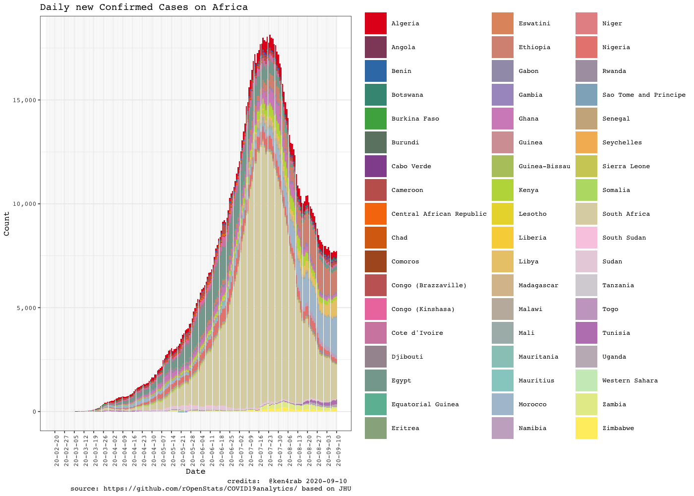

``` r
rc$ggplotComparisonExponentialGrowth(included.countries = africa.countries, min.cases = 20)
#> Warning: ggrepel: 19 unlabeled data points (too many overlaps). Consider
#> increasing max.overlaps
```

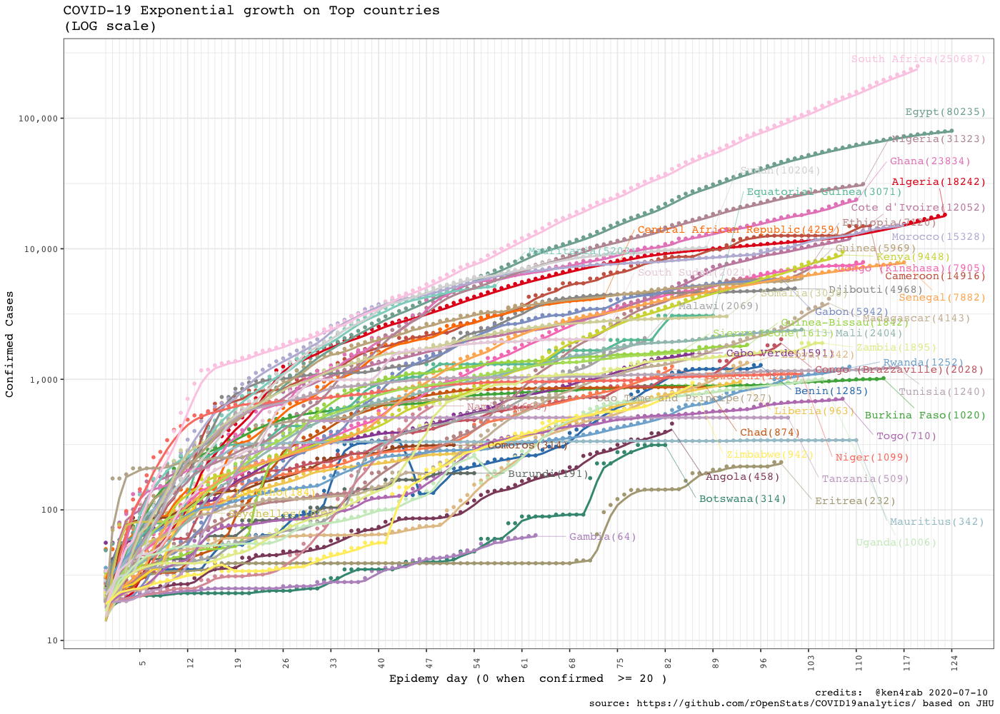

``` r
rg$ggplotCountriesLines(included.countries = africa.countries, countries.text = "Africa countries",
                        field = "confirmed.inc", log.scale = TRUE)
#> Warning: Removed 318 row(s) containing missing values (geom_path).
#> Warning: ggrepel: 3 unlabeled data points (too many overlaps). Consider
#> increasing max.overlaps
```

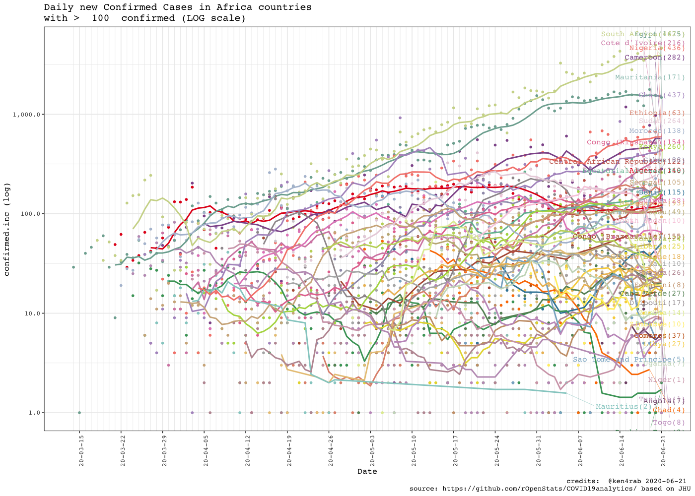

``` r
rc$ggplotComparisonExponentialGrowth(included.countries = africa.countries, 
                                     field = "deaths", y.label = "deaths", min.cases = 1)
#> Warning: ggrepel: 17 unlabeled data points (too many overlaps). Consider
#> increasing max.overlaps
```

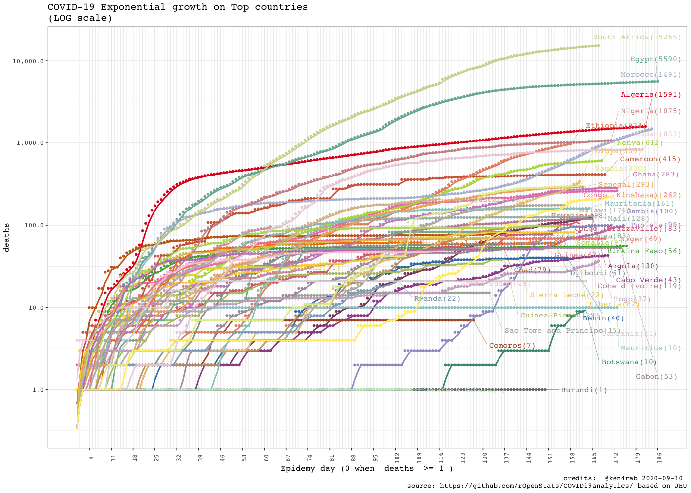

``` r
rg$ggplotTopCountriesStackedBarDailyInc(top.countries)
#> Warning: Removed 67 rows containing missing values (position_stack).
```

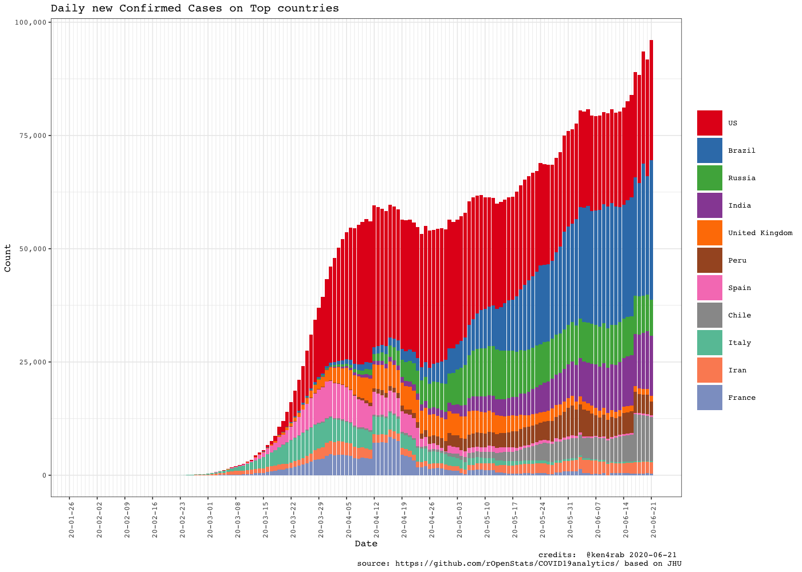

``` r
rc$ggplotComparisonExponentialGrowth(included.countries = international.countries, 
                                               min.cases = 100)
#> Warning: Removed 2 row(s) containing missing values (geom_path).
#> Warning: ggrepel: 1 unlabeled data points (too many overlaps). Consider
#> increasing max.overlaps
```

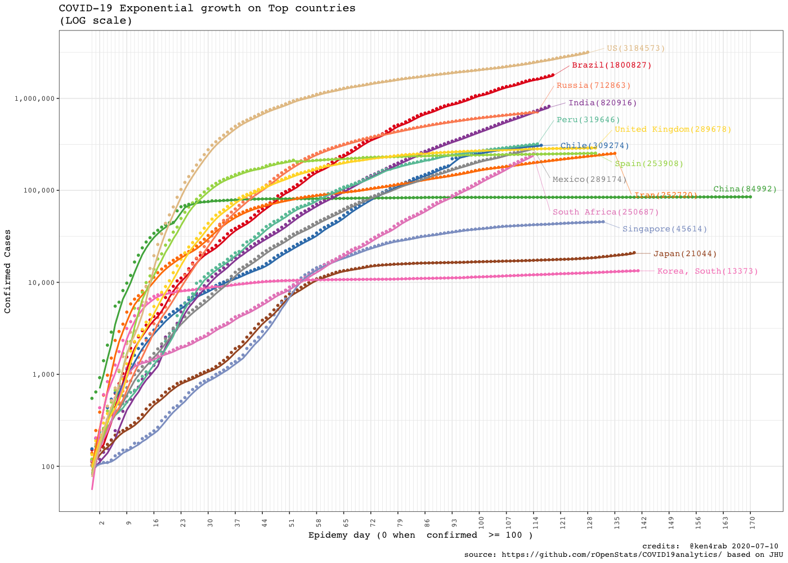

``` r
rg$ggplotCountriesLines(field = "confirmed.inc", log.scale = TRUE)
#> Warning: Removed 66 row(s) containing missing values (geom_path).
```

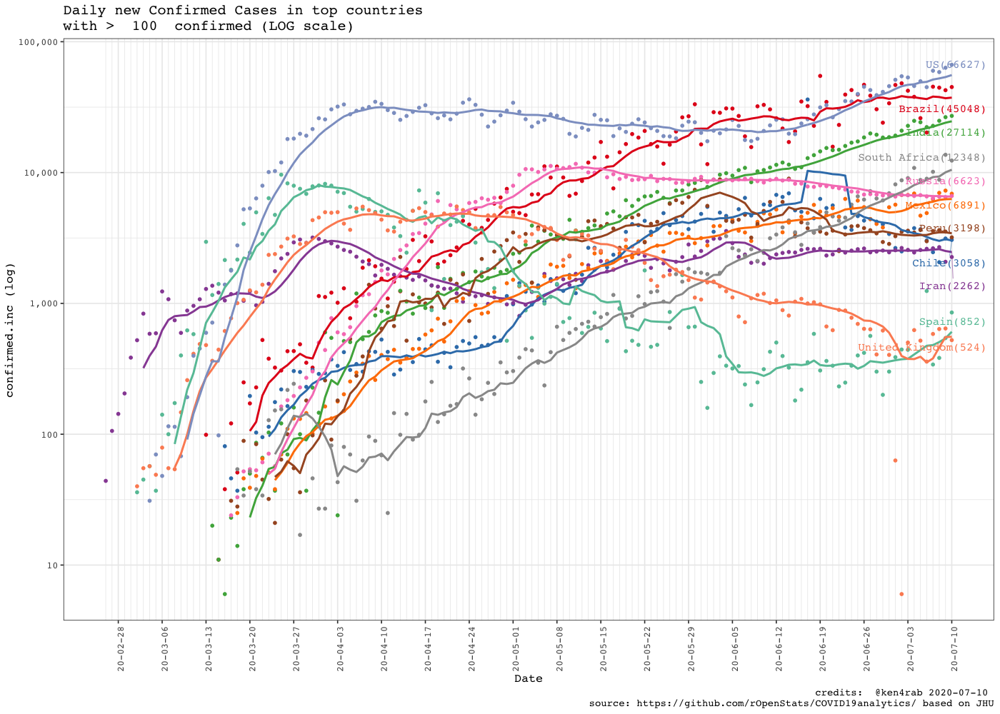

``` r
rg$ggplotCountriesLines(field = "rate.inc.daily", log.scale = TRUE)
#> Warning: Transformation introduced infinite values in continuous y-axis

#> Warning: Removed 66 row(s) containing missing values (geom_path).
```

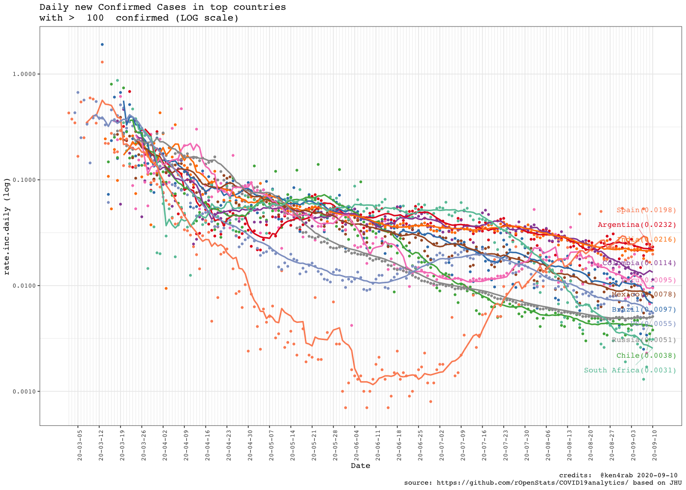

``` r
rg$ggplotTopCountriesPie()
```

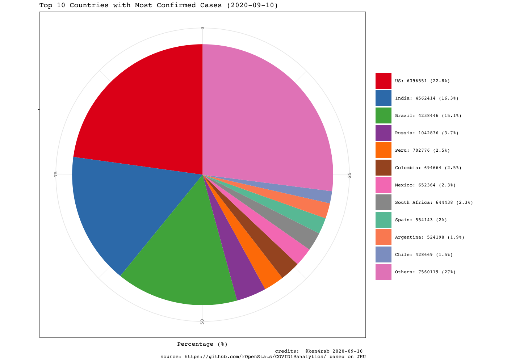

``` r
rg$ggplotTopCountriesBarPlots()
```

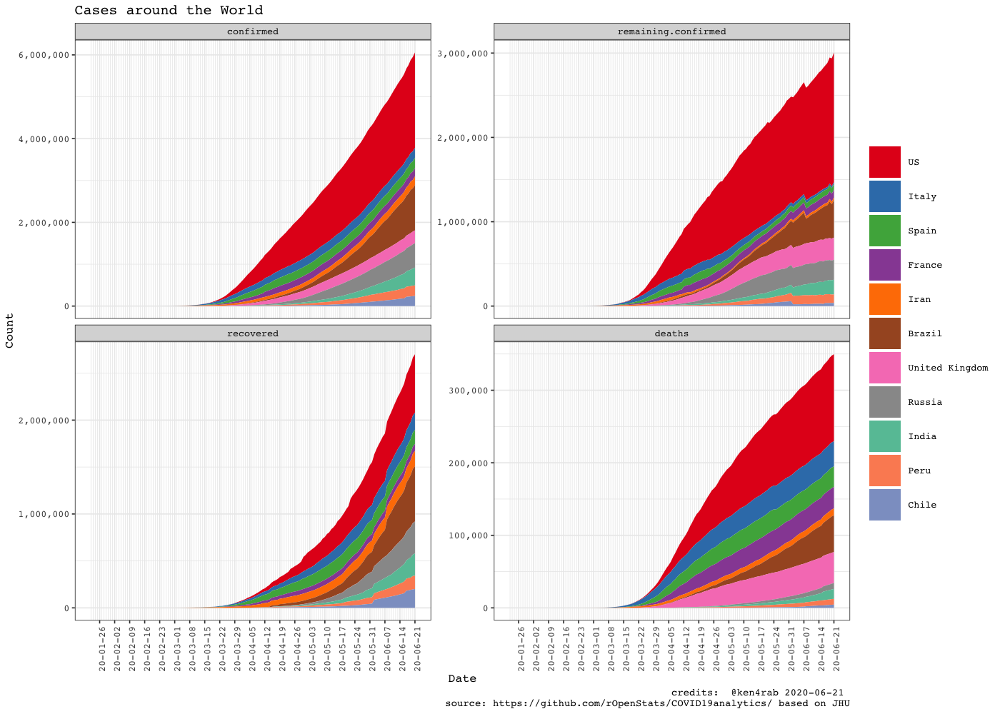

``` r
rg$ggplotCountriesBarGraphs(selected.country = "Ethiopia")
```

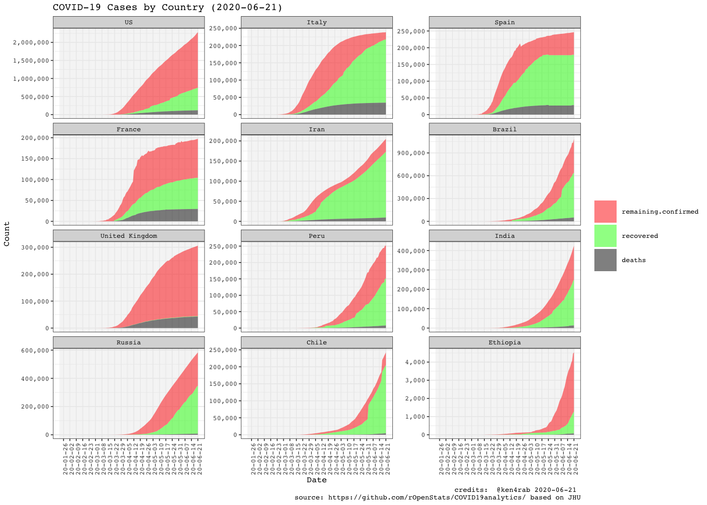
