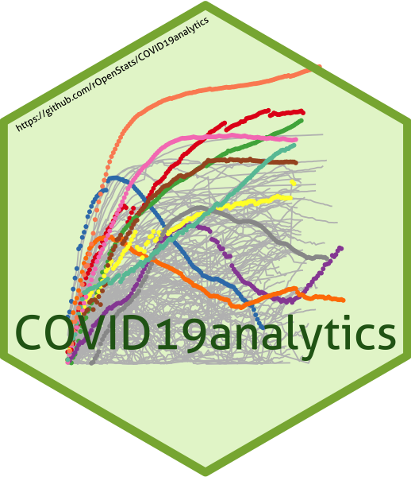

<!-- README.md is generated from README.Rmd. Please edit that file -->

```{r, include = FALSE}
knitr::opts_chunk$set(
  collapse = TRUE,
  dpi=200,
  comment = "#>",
  fig.path = "man/figures/README-",
  out.width = "100%"
)
```




# COVID19analytics

 <!-- . -->


This package curate (downloads, clean, consolidate, smooth) data from [Johns Hopkins](https://github.com/CSSEGISandData/COVID-19/) and [Our world in data](https://ourworldindata.org/coronavirus) for analysing international outbreak of COVID-19. 
 
It includes several visualizations of the COVID-19 international outbreak.


* COVID19DataProcessor generates curated series
* [visualizations](https://www.r-bloggers.com/coronavirus-data-analysis-with-r-tidyverse-and-ggplot2/) by [Yanchang Zhao](https://www.r-bloggers.com/author/yanchang-zhao/) are included in ReportGenerator R6 object 
* More visualizations included int ReportGeneratorEnhanced R6 object
* Visualizations ReportGeneratorDataComparison compares all countries counting epidemy day 0 when confirmed cases > n (i.e. n = 100).


# Package

<!-- badges: start -->
| Release | Usage | Development |
|:--------|:------|:------------|
| | [](https://cran.r-project.org/) | [](https://travis-ci.org/rOpenStats/COVID19analytics) |
| [](https://cran.r-project.org/package=COVID19analytics) | | [](https://codecov.io/gh/rOpenStats/COVID19analytics) |
|||[](https://www.repostatus.org/#active)|
<!-- badges: end -->

# How to get started (Development version)

Install the R package using the following commands on the R console:

```R
# install.packages("devtools")
devtools::install_github("rOpenStats/COVID19analytics", build_opts = NULL)
```

First configurate environment variables with your preferred configurations in `~/.Renviron`. COVID19analytics_data_dir is mandatory while COVID19analytics_credits can be configured if you want to publish your own research with space separated alias. Mention previous authors where corresponding

```.Renviron
COVID19analytics_data_dir = "~/.R/COVID19analytics"
# If you want to generate your own reports
COVID19analytics_credits = "@alias1 @alias2 @aliasn"
```


    
# How to use it

```{r, libraries}
library(COVID19analytics) 
library(dplyr)
library(knitr)
library(lgr)
```


```{r, log-config}
log.dir <- file.path(getEnv("data_dir"), "logs")
dir.create(log.dir, recursive = TRUE, showWarnings = FALSE)
log.file <- file.path(log.dir, "covid19analytics.log")
lgr::get_logger("root")$add_appender(AppenderFile$new(log.file))
lgr::threshold("info", lgr::get_logger("root"))
lgr::threshold("info", lgr::get_logger("COVID19ARCurator"))
```

```{r, load-processor}
data.processor <- COVID19DataProcessor$new(provider = "JohnsHopkingsUniversity", missing.values = "imputation")

#dummy <- data.processor$preprocess() is setupData + transform is the preprocess made by data provider
dummy <- data.processor$setupData()
dummy <- data.processor$transform()
# Curate is the process made by missing values method
dummy <- data.processor$curate()

current.date <- max(data.processor$getData()$date)

rg <- ReportGeneratorEnhanced$new(data.processor)
rc <- ReportGeneratorDataComparison$new(data.processor = data.processor)

top.countries <- data.processor$top.countries
international.countries <- unique(c(data.processor$top.countries,
                                    "China", "Japan", "Singapore", "Korea, South"))
latam.countries <- sort(c("Mexico",
                     data.processor$countries$getCountries(division = "sub.continent", name = "Caribbean"),
                     data.processor$countries$getCountries(division = "sub.continent", name = "Central America"),
                     data.processor$countries$getCountries(division = "sub.continent", name = "South America")))

```

```{r, top-countries-confirmed-inc}
# Top 10 daily cases confirmed increment
kable((data.processor$getData() %>%
  filter(date == current.date) %>%
  select(country, date, rate.inc.daily, confirmed.inc, confirmed, deaths, deaths.inc) %>%
  arrange(desc(confirmed.inc)) %>%
  filter(confirmed >=10))[1:10,])
```


```{r, top-countries-confirmed-deaths}
# Top 10 daily deaths increment
kable((data.processor$getData() %>%
  filter(date == current.date) %>%
  select(country, date, rate.inc.daily, confirmed.inc, confirmed, deaths, deaths.inc) %>%
  arrange(desc(deaths.inc)))[1:10,])
```

```{r, dataviz-4-latam}
rg$ggplotTopCountriesStackedBarDailyInc(included.countries = latam.countries, countries.text = "Latam countries")
rc$ggplotComparisonExponentialGrowth(included.countries = latam.countries, countries.text = "Latam countries",   
                                     field = "confirmed", y.label = "Confirmed", min.cases = 100)
rc$ggplotComparisonExponentialGrowth(included.countries = latam.countries, countries.text = "Latam countries",   
                                     field = "remaining.confirmed", y.label = "Active cases", min.cases = 100)
rc$ggplotComparisonExponentialGrowth(included.countries = latam.countries, field = "deaths", y.label = "Deaths", min.cases = 1)

rg$ggplotCrossSection(included.countries = latam.countries,
                       field.x = "confirmed",
                       field.y = "fatality.rate.max",
                       plot.description  = "Cross section Confirmed vs  Death rate min",
                       log.scale.x = TRUE,
                       log.scale.y = FALSE)
 
```
```{r, dataviz-6-latam-inc-daily}

rg$ggplotCountriesLines(included.countries = latam.countries, countries.text = "Latam countries",
                        field = "confirmed.inc", log.scale = TRUE)
rg$ggplotCountriesLines(included.countries = latam.countries, countries.text = "Latam countries",
                        field = "deaths.inc", log.scale = TRUE)
rg$ggplotCountriesLines(included.countries = latam.countries, countries.text = "Latam countries",
                        field = "rate.inc.daily", log.scale = TRUE)
```


```{r, dataviz-7-top-countries}
rg$ggplotTopCountriesStackedBarDailyInc(top.countries)
rc$ggplotComparisonExponentialGrowth(included.countries = international.countries, 
                                     field = "confirmed", y.label = "Confirmed", min.cases = 100)
rc$ggplotComparisonExponentialGrowth(included.countries = international.countries, 
                                     field = "remaining.confirmed", y.label = "Active cases", min.cases = 100)
rc$ggplotComparisonExponentialGrowth(included.countries = international.countries, field = "deaths", 
                                     y.label = "Deaths", min.cases = 1)
rg$ggplotCrossSection(included.countries = international.countries,
                       field.x = "confirmed",
                       field.y = "fatality.rate.max",
                       plot.description  = "Cross section Confirmed vs Death rate min",
                       log.scale.x = TRUE,
                       log.scale.y = FALSE)

```


```{r, dataviz-8-top-countries-inc-daily}
rg$ggplotCountriesLines(field = "confirmed.inc", log.scale = TRUE)
rg$ggplotCountriesLines(field = "deaths.inc", log.scale = TRUE)
rg$ggplotCountriesLines(field = "rate.inc.daily", log.scale = TRUE)
```


```{r, dataviz-9-top-countries-legacy}
rg$ggplotTopCountriesPie()
rg$ggplotTopCountriesBarPlots()
rg$ggplotCountriesBarGraphs(selected.country = "Argentina")
```


# References

* Johns Hopkins University. Retrieved from: ‘https://github.com/CSSEGISandData/COVID-19/’ [Online Resource]

* OurWorldInData.org. Retrieved from: ‘https://ourworldindata.org/coronavirus’ [Online Resource]

Yanchang Zhao, COVID-19 Data Analysis with Tidyverse and Ggplot2 - China. RDataMining.com, 2020.

URL: http://www.rdatamining.com/docs/Coronavirus-data-analysis-china.pdf.


  
