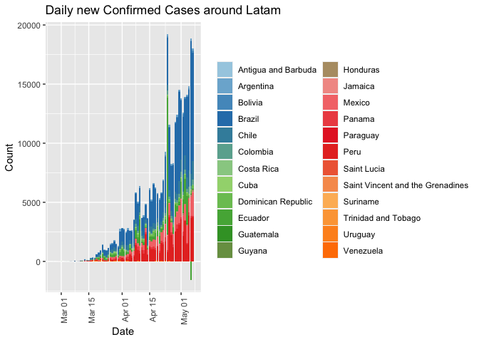
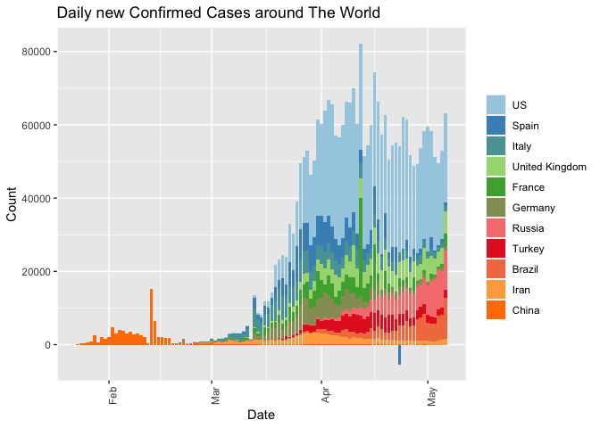
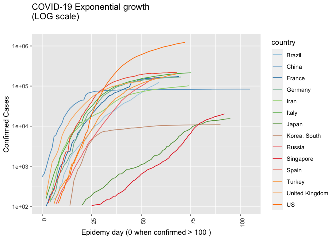

<!-- README.md is generated from README.Rmd. Please edit that file -->

# COVID19analytics

<!-- . -->

This package curate (downloads, clean, consolidate, smooth) [data from
Johns Hokpins](https://github.com/CSSEGISandData/COVID-19/) for
analysing international outbreak of COVID-19.

It includes several visualizations of the COVID-19 international
outbreak.

The package was inspired by [this
blogpost](https://www.r-bloggers.com/coronavirus-data-analysis-with-r-tidyverse-and-ggplot2/)
from [Yanchang Zhao](https://www.r-bloggers.com/author/yanchang-zhao/)

Yanchang Zhao, COVID-19 Data Analysis with Tidyverse and Ggplot2 -
China. RDataMining.com, 2020.

URL:
<http://www.rdatamining.com/docs/Coronavirus-data-analysis-china.pdf>.

  - COVID19DataProcessor generates curated series
  - The original process and visualizations are included in
    ReportGenerator R6 object
  - More process and visualization included int ReportGeneratorEnhanced
    R6 object

# Consideration

Data is still noisy because there are missing data from some regions in
some days. We are working on in it.

# Package

<!-- badges: start -->

| Release                                                                                                              | Usage                                                                                                    | Development                                                                                                                                                                                            |
| :------------------------------------------------------------------------------------------------------------------- | :------------------------------------------------------------------------------------------------------- | :----------------------------------------------------------------------------------------------------------------------------------------------------------------------------------------------------- |
|                                                                                                                      | [](https://cran.r-project.org/) | [](https://travis-ci.org/rOpenStats/COVID19analytics)                                                                    |
| [](https://cran.r-project.org/package=COVID19analytics) |                                                                                                          | [](https://codecov.io/gh/rOpenStats/COVID19analytics)                                                       |
|                                                                                                                      |                                                                                                          | [](https://www.repostatus.org/#active) |

<!-- badges: end -->

# How to get started (Development version)

Install the R package using the following commands on the R console:

``` r
# install.packages("devtools")
devtools::install_github("rOpenStats/COVID19analytics", build_opts = NULL)
```

# How to use it

``` r
library(COVID19analytics) # Optional but strongly recommended
#> Warning: replacing previous import 'ggplot2::Layout' by 'lgr::Layout' when
#> loading 'COVID19analytics'
#> Warning: replacing previous import 'dplyr::intersect' by 'lubridate::intersect'
#> when loading 'COVID19analytics'
#> Warning: replacing previous import 'dplyr::union' by 'lubridate::union' when
#> loading 'COVID19analytics'
#> Warning: replacing previous import 'dplyr::setdiff' by 'lubridate::setdiff' when
#> loading 'COVID19analytics'
#> Registered S3 method overwritten by 'quantmod':
#>   method            from
#>   as.zoo.data.frame zoo
#> Warning: replacing previous import 'magrittr::extract' by 'tidyr::extract' when
#> loading 'COVID19analytics'
```

``` r
data.processor <- COVID19DataProcessor$new(force.download = FALSE)
dummy <- data.processor$curate()
#> INFO  [22:22:24.252]  {stage: data loaded}
#> Warning in countrycode(x, origin = "country.name", destination = "continent"): Some values were not matched unambiguously: MS Zaandam
#> INFO  [22:22:26.451]  {stage: consolidated}
#> INFO  [22:22:27.295]  {stage: Starting first imputation}
#> INFO  [22:22:27.297] Imputation indicator {indicator: confirmed}
#> INFO  [22:22:27.337] Imputation indicator {indicator: recovered}
#> INFO  [22:22:27.416] Imputation indicator {indicator: deaths}
#> INFO  [22:22:28.620]  {stage: Calculating top countries}

rg <- ReportGeneratorEnhanced$new(data.processor)
rc <- ReportGeneratorDataComparison$new(data.processor = data.processor)

top.countries <- data.processor$top.countries
international.countries <- unique(c(data.processor$top.countries,
                                    "Japan", "Singapore", "Korea, South"))
latam.countries <- sort(c("Mexico",
                     data.processor$countries$getCountries(division = "sub.continent", name = "Caribbean"),
                     data.processor$countries$getCountries(division = "sub.continent", name = "Central America"),
                     data.processor$countries$getCountries(division = "sub.continent", name = "South America")))
```

``` r
rg$ggplotTopCountriesStackedBarDailyInc(included.countries = latam.countries,
                                                  map.region = "Latam")
```



``` r
rc$ggplotComparisonExponentialGrowth(included.countries = latam.countries, min.cases = 20)
```


``` r
rg$ggplotTopCountriesStackedBarDailyInc(top.countries)
#> Warning: Removed 2 rows containing missing values (position_stack).
```



``` r
rc$ggplotComparisonExponentialGrowth(included.countries = international.countries, 
                                               min.cases = 100)
```



``` r
rg$ggplotTopCountriesLines(field = "confirmed.inc", log.scale = TRUE)
```


``` r
rg$ggplotTopCountriesLines(field = "rate.inc.daily", log.scale = FALSE)
```


``` r
rg$ggplotTopCountriesPie()
#> Scale for 'fill' is already present. Adding another scale for 'fill', which
#> will replace the existing scale.
```


``` r
rg$ggplotTopCountriesBarPlots()
```


``` r
rg$ggplotCountriesBarGraphs(selected.country = "Argentina")
```


