<!-- README.md is generated from README.Rmd. Please edit that file -->

# COVID19analytics

<!-- . -->

This package curate (downloads, clean, consolidate, smooth) [data from
Johns Hokpins](https://github.com/CSSEGISandData/COVID-19/) for
analysing international outbreak of COVID-19.

It includes several visualizations of the COVID-19 international
outbreak.

Yanchang Zhao, COVID-19 Data Analysis with Tidyverse and Ggplot2 -
China. RDataMining.com, 2020.

URL:
<http://www.rdatamining.com/docs/Coronavirus-data-analysis-china.pdf>.

  - COVID19DataProcessor generates curated series
  - [visualizations](https://www.r-bloggers.com/coronavirus-data-analysis-with-r-tidyverse-and-ggplot2/)
    by [Yanchang Zhao](https://www.r-bloggers.com/author/yanchang-zhao/)
    are included in ReportGenerator R6 object
  - More visualizations included int ReportGeneratorEnhanced R6 object
  - Visualizations ReportGeneratorDataComparison compares all countries
    counting epidemy day 0 when confirmed cases \> n (i.e. n = 100).

# Consideration

Data is still noisy because there are missing data from some regions in
some days. We are working on in it.

# Package

<!-- badges: start -->

| Release                                                                                                              | Usage                                                                                                    | Development                                                                                                                                                                                            |
| :------------------------------------------------------------------------------------------------------------------- | :------------------------------------------------------------------------------------------------------- | :----------------------------------------------------------------------------------------------------------------------------------------------------------------------------------------------------- |
|                                                                                                                      | [](https://cran.r-project.org/) | [](https://travis-ci.org/rOpenStats/COVID19analytics)                                                                    |
| [](https://cran.r-project.org/package=COVID19analytics) |                                                                                                          | [](https://codecov.io/gh/rOpenStats/COVID19analytics)                                                       |
|                                                                                                                      |                                                                                                          | [](https://www.repostatus.org/#active) |

<!-- badges: end -->

# How to get started (Development version)

Install the R package using the following commands on the R console:

``` r
# install.packages("devtools")
devtools::install_github("rOpenStats/COVID19analytics", build_opts = NULL)
```

# How to use it

``` r
library(COVID19analytics) 
#> Warning: replacing previous import 'ggplot2::Layout' by 'lgr::Layout' when
#> loading 'COVID19analytics'
#> Warning: replacing previous import 'dplyr::intersect' by 'lubridate::intersect'
#> when loading 'COVID19analytics'
#> Warning: replacing previous import 'dplyr::union' by 'lubridate::union' when
#> loading 'COVID19analytics'
#> Warning: replacing previous import 'dplyr::setdiff' by 'lubridate::setdiff' when
#> loading 'COVID19analytics'
#> Warning: replacing previous import 'readr::col_factor' by 'scales::col_factor'
#> when loading 'COVID19analytics'
#> Warning: replacing previous import 'magrittr::equals' by 'testthat::equals' when
#> loading 'COVID19analytics'
#> Warning: replacing previous import 'magrittr::not' by 'testthat::not' when
#> loading 'COVID19analytics'
#> Warning: replacing previous import 'magrittr::is_less_than' by
#> 'testthat::is_less_than' when loading 'COVID19analytics'
#> Warning: replacing previous import 'dplyr::matches' by 'testthat::matches' when
#> loading 'COVID19analytics'
#> Warning: replacing previous import 'testthat::matches' by 'tidyr::matches' when
#> loading 'COVID19analytics'
#> Warning: replacing previous import 'magrittr::extract' by 'tidyr::extract' when
#> loading 'COVID19analytics'
library(dplyr) 
#> 
#> Attaching package: 'dplyr'
#> The following objects are masked from 'package:stats':
#> 
#>     filter, lag
#> The following objects are masked from 'package:base':
#> 
#>     intersect, setdiff, setequal, union
```

``` r
data.processor <- COVID19DataProcessor$new(provider = "JohnsHopkingsUniversity", missing.values = "imputation")

#dummy <- data.processor$preprocess() is setupData + transform is the preprocess made by data provider
dummy <- data.processor$setupData()
#> INFO  [01:48:08.040]  {stage: processor-setup}
#> INFO  [01:48:08.068] Checking required downloaded  {downloaded.max.date: 2020-05-28, daily.update.time: 21:00:00, current.datetime: 2020-05-29 0.., download.flag: FALSE}
#> INFO  [01:48:08.164] Checking required downloaded  {downloaded.max.date: 2020-05-28, daily.update.time: 21:00:00, current.datetime: 2020-05-29 0.., download.flag: FALSE}
#> INFO  [01:48:08.258] Checking required downloaded  {downloaded.max.date: 2020-05-28, daily.update.time: 21:00:00, current.datetime: 2020-05-29 0.., download.flag: FALSE}
#> INFO  [01:48:08.304]  {stage: data loaded}
#> INFO  [01:48:08.305]  {stage: data-setup}
dummy <- data.processor$transform()
#> INFO  [01:48:08.308] Executing transform 
#> INFO  [01:48:08.309] Executing consolidate 
#> INFO  [01:48:09.590]  {stage: consolidated}
#> INFO  [01:48:09.592] Executing standarize 
#> INFO  [01:48:09.648] gathering DataModel 
#> INFO  [01:48:09.649]  {stage: datamodel-setup}
# Curate is the process made by missing values method
dummy <- data.processor$curate()
#> INFO  [01:48:09.652]  {stage: loading-aggregated-data-model}
#> Warning in countrycode(x, origin = "country.name", destination = "continent"): Some values were not matched unambiguously: MS Zaandam
#> INFO  [01:48:11.234]  {stage: calculating-rates}
#> INFO  [01:48:11.380]  {stage: making-data-comparison}
#> INFO  [01:48:12.501]  {stage: applying-missing-values-method}
#> INFO  [01:48:12.502]  {stage: Starting first imputation}
#> INFO  [01:48:12.505]  {stage: calculating-rates}
#> INFO  [01:48:12.671]  {stage: making-data-comparison-2}
#> INFO  [01:48:13.648]  {stage: calculating-top-countries}
#> INFO  [01:48:13.663]  {stage: processed}

current.date <- max(data.processor$getData()$date)

rg <- ReportGeneratorEnhanced$new(data.processor)
rc <- ReportGeneratorDataComparison$new(data.processor = data.processor)

top.countries <- data.processor$top.countries
international.countries <- unique(c(data.processor$top.countries,
                                    "Japan", "Singapore", "Korea, South"))
latam.countries <- sort(c("Mexico",
                     data.processor$countries$getCountries(division = "sub.continent", name = "Caribbean"),
                     data.processor$countries$getCountries(division = "sub.continent", name = "Central America"),
                     data.processor$countries$getCountries(division = "sub.continent", name = "South America")))
```

``` r
# Top 10 daily cases confirmed increment
(data.processor$getData() %>%
  filter(date == current.date) %>%
  select(country, date, rate.inc.daily, confirmed.inc, confirmed, deaths, deaths.inc) %>%
  arrange(desc(confirmed.inc)) %>%
  filter(confirmed >=10))[1:10,]
#> # A tibble: 10 x 7
#> # Groups:   country [10]
#>    country  date       rate.inc.daily confirmed.inc confirmed deaths deaths.inc
#>    <chr>    <date>              <dbl>         <int>     <int>  <int>      <int>
#>  1 Brazil   2020-05-28          0.064         26417    438238  26754       1156
#>  2 US       2020-05-28          0.013         22577   1721753 101616       1199
#>  3 Russia   2020-05-28          0.023          8371    379051   4142        174
#>  4 India    2020-05-28          0.046          7300    165386   4711        177
#>  5 Peru     2020-05-28          0.043          5874    141779   4099        116
#>  6 Chile    2020-05-28          0.057          4654     86943    890         49
#>  7 Mexico   2020-05-28          0.043          3377     81400   9044        447
#>  8 France   2020-05-28          0.018          3326    186364  28665         66
#>  9 Iran     2020-05-28          0.016          2258    143849   7627         63
#> 10 Pakistan 2020-05-28          0.035          2076     61227   1260         35
```

``` r
# Top 10 daily deaths increment
(data.processor$getData() %>%
  filter(date == current.date) %>%
  select(country, date, rate.inc.daily, confirmed.inc, confirmed, deaths, deaths.inc) %>%
  arrange(desc(deaths.inc)))[1:10,]
#> # A tibble: 10 x 7
#> # Groups:   country [10]
#>    country   date       rate.inc.daily confirmed.inc confirmed deaths deaths.inc
#>    <chr>     <date>              <dbl>         <int>     <int>  <int>      <int>
#>  1 US        2020-05-28          0.013         22577   1721753 101616       1199
#>  2 Brazil    2020-05-28          0.064         26417    438238  26754       1156
#>  3 Mexico    2020-05-28          0.043          3377     81400   9044        447
#>  4 United K… 2020-05-28          0.007          1889    270508  37919        377
#>  5 India     2020-05-28          0.046          7300    165386   4711        177
#>  6 Russia    2020-05-28          0.023          8371    379051   4142        174
#>  7 Peru      2020-05-28          0.043          5874    141779   4099        116
#>  8 Italy     2020-05-28          0.003           593    231732  33142         70
#>  9 France    2020-05-28          0.018          3326    186364  28665         66
#> 10 Iran      2020-05-28          0.016          2258    143849   7627         63
```

``` r
rg$ggplotTopCountriesStackedBarDailyInc(included.countries = latam.countries,
                                                  map.region = "Latam")
```

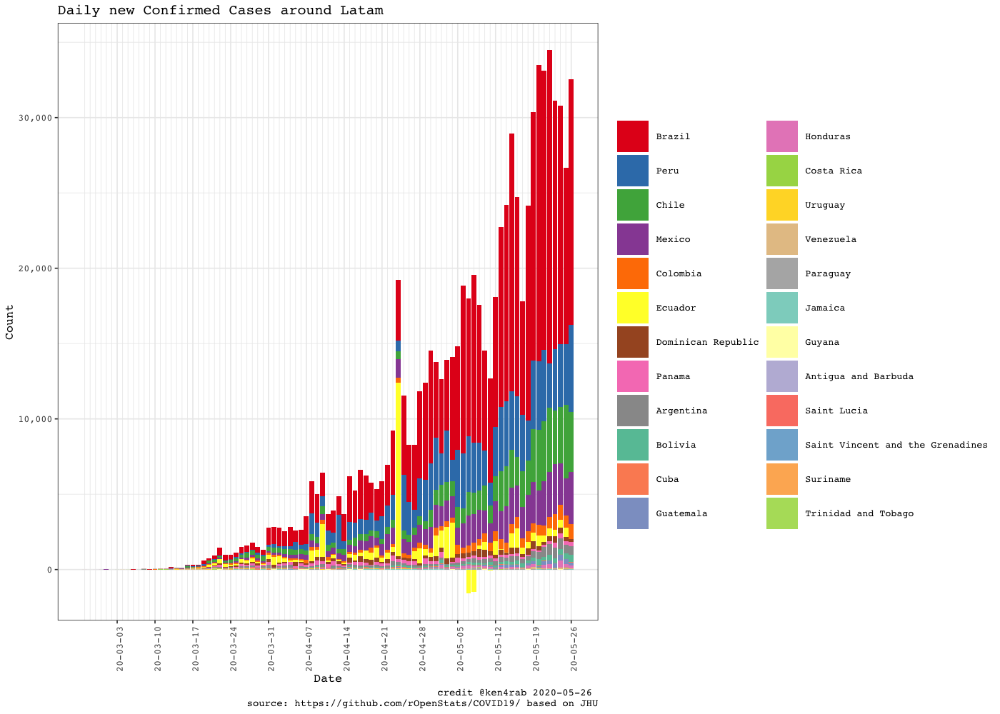

``` r
rc$ggplotComparisonExponentialGrowth(included.countries = latam.countries, min.cases = 100)
#> Scale for 'y' is already present. Adding another scale for 'y', which will
#> replace the existing scale.
```

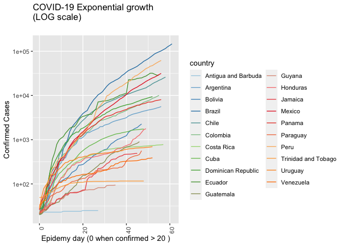

``` r

rg$ggplotCountriesLines(included.countries = latam.countries, countries.text = "Latam countries",
                        field = "confirmed.inc", log.scale = TRUE)
#> Scale for 'y' is already present. Adding another scale for 'y', which will
#> replace the existing scale.
```

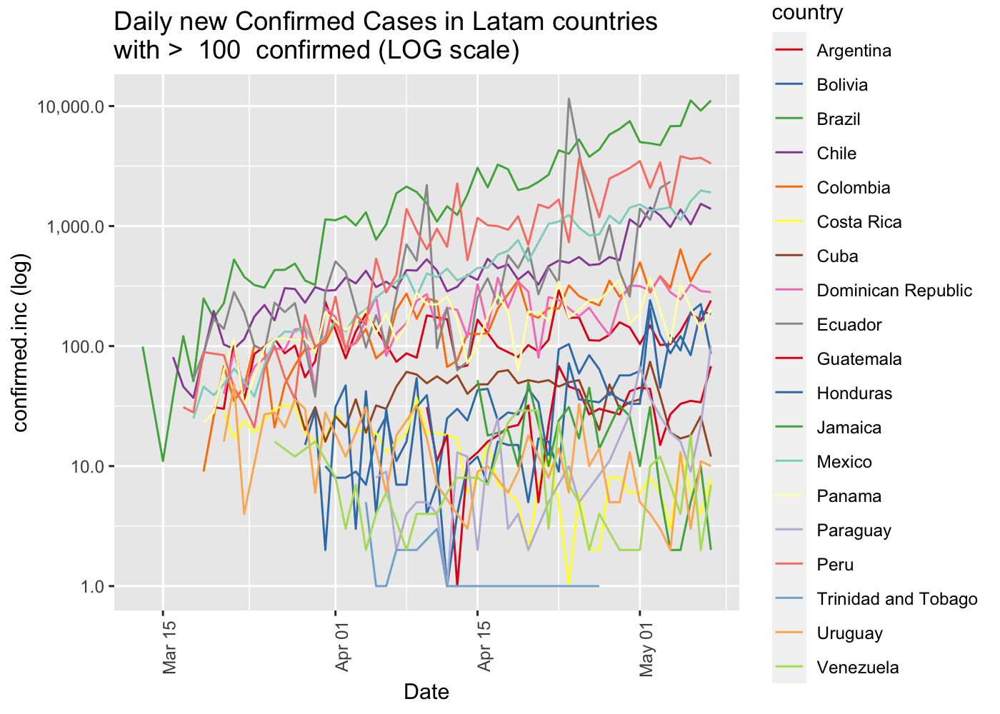

``` r

rc$ggplotComparisonExponentialGrowth(included.countries = latam.countries, field = "deaths", y.label = "Deaths", min.cases = 1)
#> Scale for 'y' is already present. Adding another scale for 'y', which will
#> replace the existing scale.
```

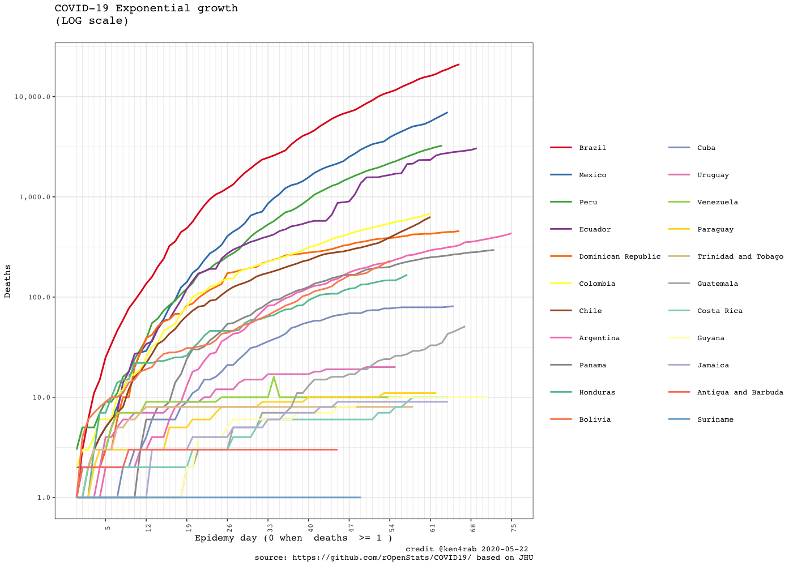

``` r

rg$ggplotCrossSection(included.countries = latam.countries,
                       field.x = "confirmed",
                       field.y = "fatality.rate.min",
                       plot.description  = "Cross section Confirmed vs  Death rate min",
                       log.scale.x = TRUE,
                       log.scale.y = FALSE)
```

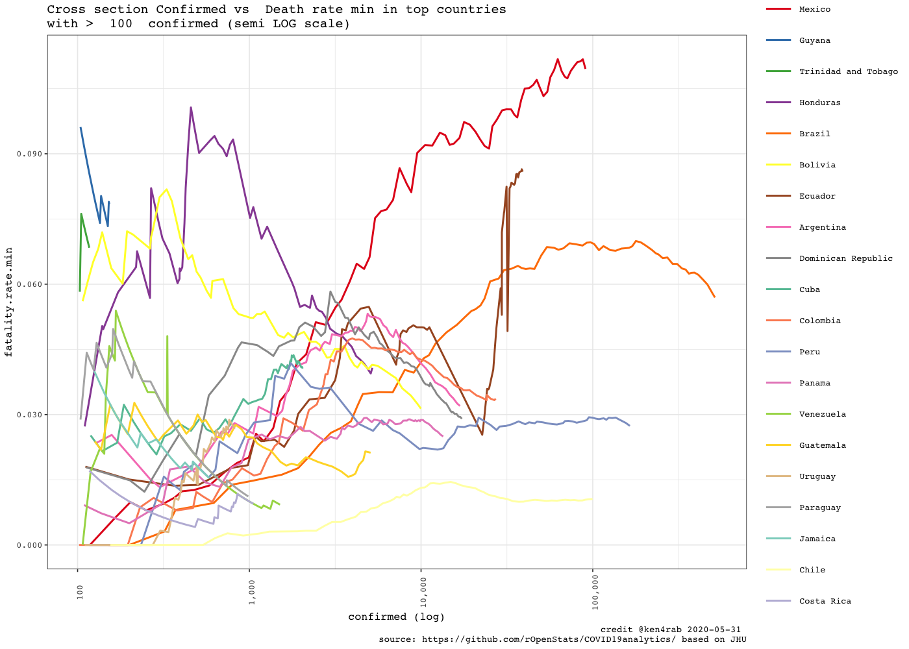

``` r
rg$ggplotTopCountriesStackedBarDailyInc(top.countries)
#> Warning: Removed 1 rows containing missing values (position_stack).
```

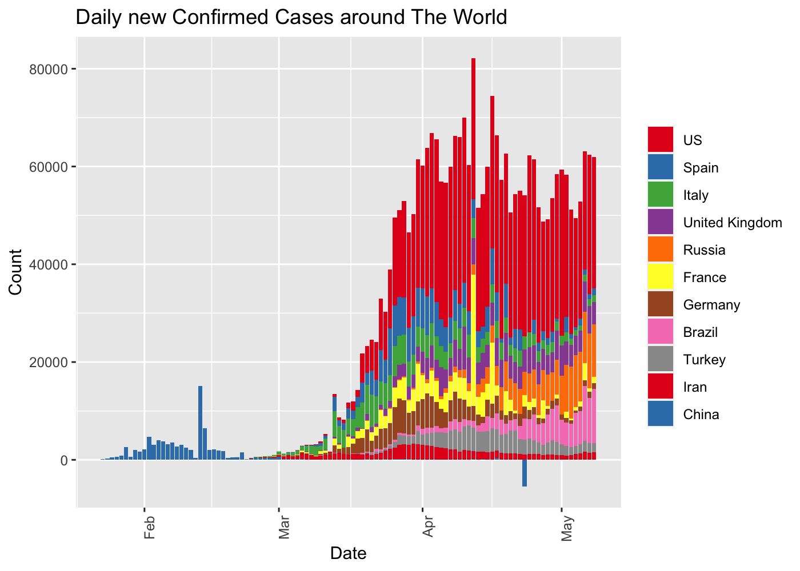

``` r
rc$ggplotComparisonExponentialGrowth(included.countries = international.countries, 
                                               min.cases = 100)
#> Scale for 'y' is already present. Adding another scale for 'y', which will
#> replace the existing scale.
```

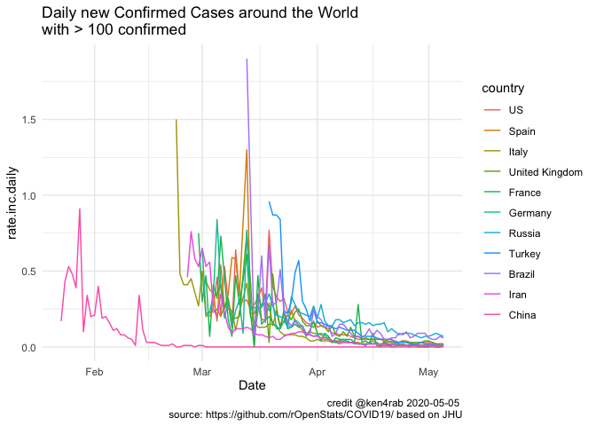

``` r
rc$ggplotComparisonExponentialGrowth(included.countries = international.countries, field = "deaths", 
                                     y.label = "Deaths", min.cases = 1)
#> Scale for 'y' is already present. Adding another scale for 'y', which will
#> replace the existing scale.
```

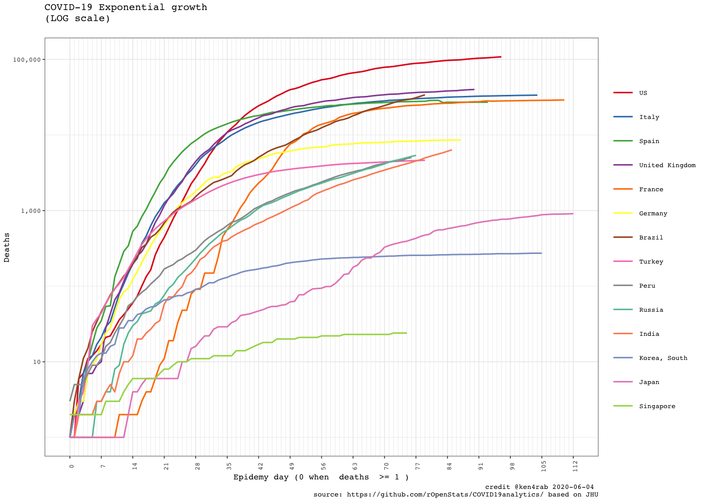

``` r
rg$ggplotCrossSection(included.countries = international.countries,
                       field.x = "confirmed",
                       field.y = "fatality.rate.min",
                       plot.description  = "Cross section Confirmed vs Death rate min",
                       log.scale.x = TRUE,
                       log.scale.y = FALSE)
```

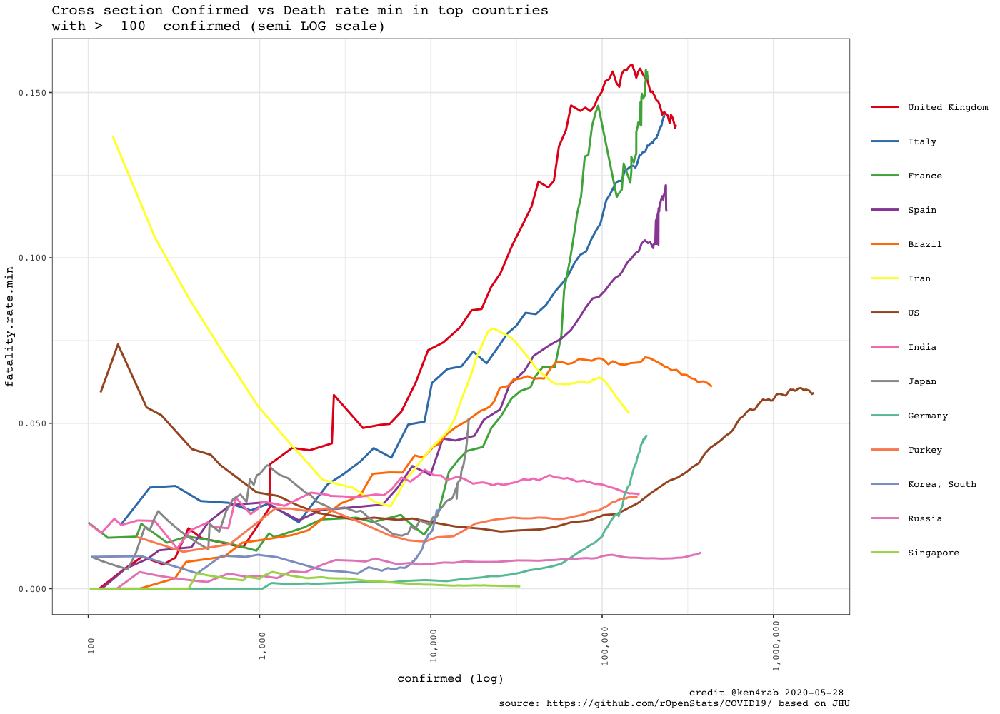

``` r
rg$ggplotCountriesLines(field = "confirmed.inc", log.scale = TRUE)
#> Scale for 'y' is already present. Adding another scale for 'y', which will
#> replace the existing scale.
```

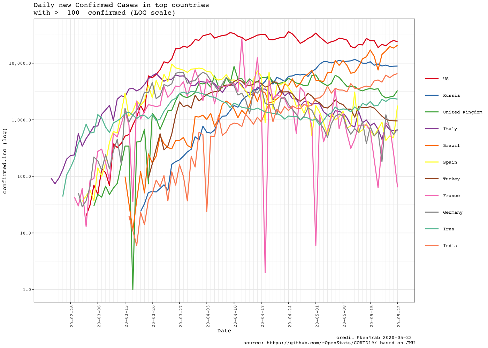

``` r
rg$ggplotCountriesLines(field = "rate.inc.daily", log.scale = TRUE)
#> Scale for 'y' is already present. Adding another scale for 'y', which will
#> replace the existing scale.
#> Warning: Transformation introduced infinite values in continuous y-axis
```

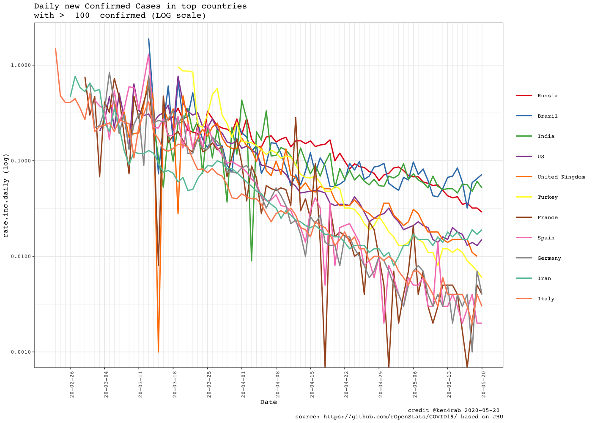

``` r
rg$ggplotTopCountriesPie()
```

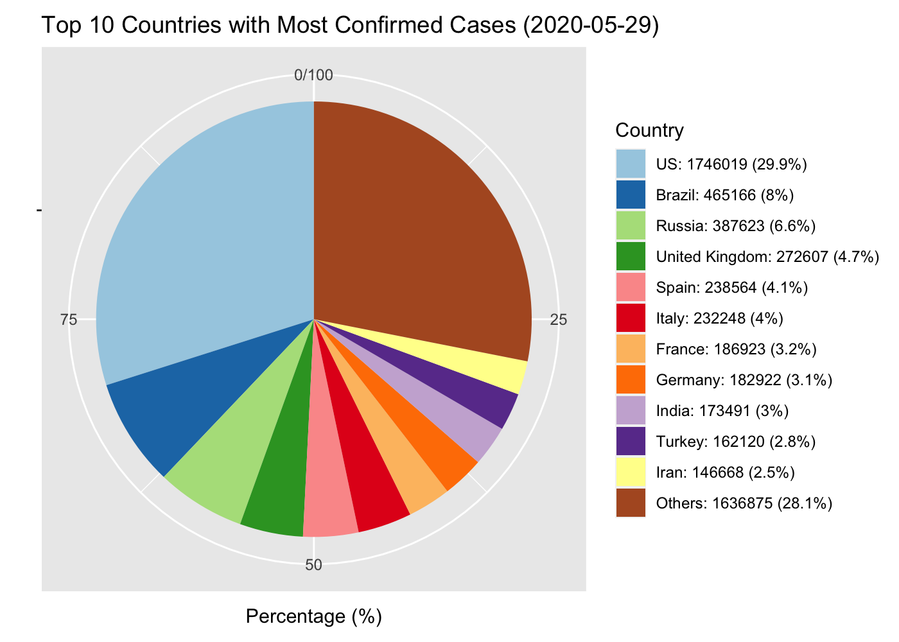

``` r
rg$ggplotTopCountriesBarPlots()
```

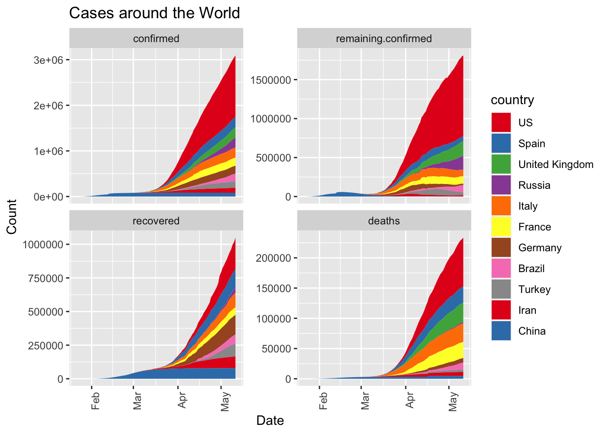

``` r
rg$ggplotCountriesBarGraphs(selected.country = "Argentina")
```

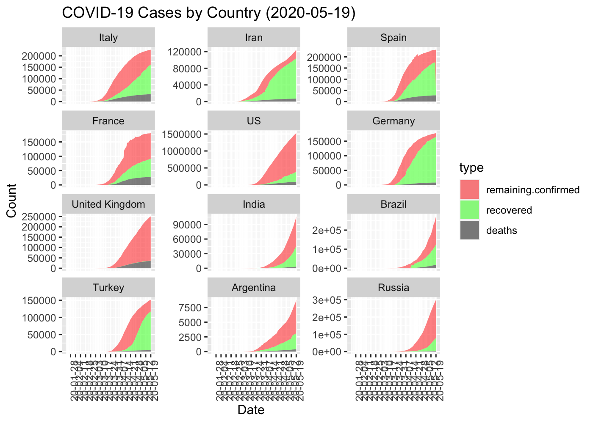
