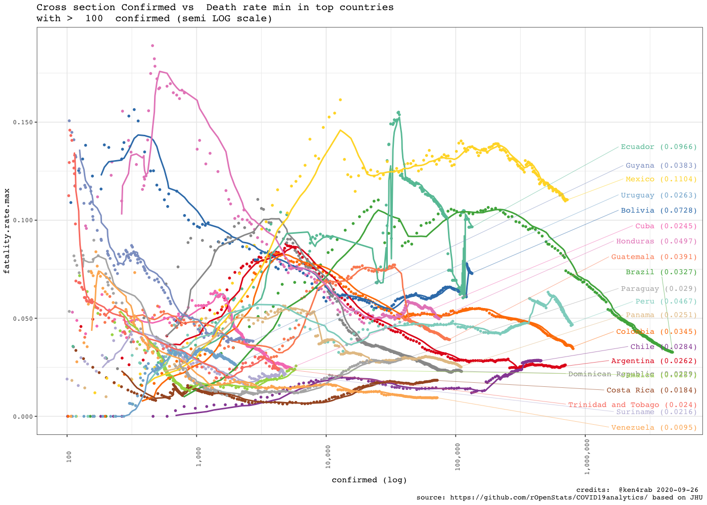

<!-- README.md is generated from README.Rmd. Please edit that file -->


# COVID19analytics

<!-- . -->

This package curate (downloads, clean, consolidate, smooth) data from
[Johns Hokpins](https://github.com/CSSEGISandData/COVID-19/) and [Our
world in data](https://ourworldindata.org/coronavirus) for analysing
international outbreak of COVID-19.

It includes several visualizations of the COVID-19 international
outbreak.

  - COVID19DataProcessor generates curated series
  - [visualizations](https://www.r-bloggers.com/coronavirus-data-analysis-with-r-tidyverse-and-ggplot2/)
    by [Yanchang Zhao](https://www.r-bloggers.com/author/yanchang-zhao/)
    are included in ReportGenerator R6 object
  - More visualizations included int ReportGeneratorEnhanced R6 object
  - Visualizations ReportGeneratorDataComparison compares all countries
    counting epidemy day 0 when confirmed cases \> n (i.e. n = 100).

# Package

<!-- badges: start -->

| Release                                                                                                              | Usage                                                                                                    | Development                                                                                                                                                                                            |
| :------------------------------------------------------------------------------------------------------------------- | :------------------------------------------------------------------------------------------------------- | :----------------------------------------------------------------------------------------------------------------------------------------------------------------------------------------------------- |
|                                                                                                                      | [](https://cran.r-project.org/) | [](https://travis-ci.org/rOpenStats/COVID19analytics)                                                                    |
| [](https://cran.r-project.org/package=COVID19analytics) |                                                                                                          | [](https://codecov.io/gh/rOpenStats/COVID19analytics)                                                       |
|                                                                                                                      |                                                                                                          | [](https://www.repostatus.org/#active) |

<!-- badges: end -->

# How to get started (Development version)

Install the R package using the following commands on the R console:

``` r
# install.packages("devtools")
devtools::install_github("rOpenStats/COVID19analytics", build_opts = NULL)
```

First configurate environment variables with your preferred
configurations in `~/.Renviron`. COVID19analytics\_data\_dir is
mandatory while COVID19analytics\_credits can be configured if you want
to publish your own research with space separated alias. Mention
previous authors where corresponding

``` .renviron
COVID19analytics_data_dir = "~/.R/COVID19analytics"
# If you want to generate your own reports
COVID19analytics_credits = "@alias1 @alias2 @aliasn"
```

# How to use it

``` r
library(COVID19analytics) 
#> Warning: replacing previous import 'ggplot2::Layout' by 'lgr::Layout' when
#> loading 'COVID19analytics'
#> Warning: replacing previous import 'readr::col_factor' by 'scales::col_factor'
#> when loading 'COVID19analytics'
#> Warning: replacing previous import 'magrittr::equals' by 'testthat::equals' when
#> loading 'COVID19analytics'
#> Warning: replacing previous import 'magrittr::not' by 'testthat::not' when
#> loading 'COVID19analytics'
#> Warning: replacing previous import 'magrittr::is_less_than' by
#> 'testthat::is_less_than' when loading 'COVID19analytics'
#> Warning: replacing previous import 'dplyr::matches' by 'testthat::matches' when
#> loading 'COVID19analytics'
#> Warning: replacing previous import 'testthat::matches' by 'tidyr::matches' when
#> loading 'COVID19analytics'
#> Warning: replacing previous import 'magrittr::extract' by 'tidyr::extract' when
#> loading 'COVID19analytics'
library(dplyr)
#> 
#> Attaching package: 'dplyr'
#> The following objects are masked from 'package:stats':
#> 
#>     filter, lag
#> The following objects are masked from 'package:base':
#> 
#>     intersect, setdiff, setequal, union
library(knitr)
library(lgr)
```

``` r
log.dir <- file.path(getEnv("data_dir"), "logs")
dir.create(log.dir, recursive = TRUE, showWarnings = FALSE)
log.file <- file.path(log.dir, "covid19analytics.log")
lgr::get_logger("root")$add_appender(AppenderFile$new(log.file))
lgr::threshold("info", lgr::get_logger("root"))
lgr::threshold("info", lgr::get_logger("COVID19ARCurator"))
```

``` r
data.processor <- COVID19DataProcessor$new(provider = "JohnsHopkingsUniversity", missing.values = "imputation")

#dummy <- data.processor$preprocess() is setupData + transform is the preprocess made by data provider
dummy <- data.processor$setupData()
#> INFO  [09:17:57.998]  {stage: processor-setup}
#> INFO  [09:17:58.035] Checking required downloaded  {downloaded.max.date: 2020-06-21, daily.update.time: 21:00:00, current.datetime: 2020-06-23 0.., download.flag: TRUE}
#> INFO  [09:17:58.995] Checking required downloaded  {downloaded.max.date: 2020-06-21, daily.update.time: 21:00:00, current.datetime: 2020-06-23 0.., download.flag: TRUE}
#> INFO  [09:17:59.908] Checking required downloaded  {downloaded.max.date: 2020-06-21, daily.update.time: 21:00:00, current.datetime: 2020-06-23 0.., download.flag: TRUE}
#> INFO  [09:18:00.775]  {stage: data loaded}
#> INFO  [09:18:00.777]  {stage: data-setup}
dummy <- data.processor$transform()
#> INFO  [09:18:00.780] Executing transform 
#> INFO  [09:18:00.781] Executing consolidate 
#> INFO  [09:18:02.956]  {stage: consolidated}
#> INFO  [09:18:02.960] Executing standarize 
#> INFO  [09:18:03.517] gathering DataModel 
#> INFO  [09:18:03.519]  {stage: datamodel-setup}
# Curate is the process made by missing values method
dummy <- data.processor$curate()
#> INFO  [09:18:03.523]  {stage: loading-aggregated-data-model}
#> Warning in countrycode(x, origin = "country.name", destination = "continent"): Some values were not matched unambiguously: MS Zaandam
#> INFO  [09:18:05.358]  {stage: calculating-rates}
#> INFO  [09:18:05.571]  {stage: making-data-comparison}
#> INFO  [09:18:12.709]  {stage: applying-missing-values-method}
#> INFO  [09:18:12.711]  {stage: Starting first imputation}
#> INFO  [09:18:12.737]  {stage: calculating-rates}
#> INFO  [09:18:12.950]  {stage: making-data-comparison-2}
#> INFO  [09:18:19.725]  {stage: calculating-top-countries}
#> INFO  [09:18:19.762]  {stage: curated}

current.date <- max(data.processor$getData()$date)

rg <- ReportGeneratorEnhanced$new(data.processor)
rc <- ReportGeneratorDataComparison$new(data.processor = data.processor)

top.countries <- data.processor$top.countries
international.countries <- unique(c(data.processor$top.countries,
                                    "China", "Japan", "Singapore", "Korea, South"))
latam.countries <- sort(c("Mexico",
                     data.processor$countries$getCountries(division = "sub.continent", name = "Caribbean"),
                     data.processor$countries$getCountries(division = "sub.continent", name = "Central America"),
                     data.processor$countries$getCountries(division = "sub.continent", name = "South America")))
```

``` r
# Top 10 daily cases confirmed increment
kable((data.processor$getData() %>%
  filter(date == current.date) %>%
  select(country, date, rate.inc.daily, confirmed.inc, confirmed, deaths, deaths.inc) %>%
  arrange(desc(confirmed.inc)) %>%
  filter(confirmed >=10))[1:10,])
```

| country      | date       | rate.inc.daily | confirmed.inc | confirmed | deaths | deaths.inc |
| :----------- | :--------- | -------------: | ------------: | --------: | -----: | ---------: |
| US           | 2020-06-22 |         0.0136 |         31012 |   2312302 | 120402 |        425 |
| Brazil       | 2020-06-22 |         0.0213 |         23129 |   1106470 |  51271 |        680 |
| India        | 2020-06-22 |         0.0351 |         14933 |    440215 |  14011 |        312 |
| Russia       | 2020-06-22 |         0.0130 |          7586 |    591465 |   8196 |         95 |
| Peru         | 2020-06-22 |         0.0243 |          6109 |    257447 |   8223 |        362 |
| Chile        | 2020-06-22 |         0.0190 |          4608 |    246963 |   4502 |         23 |
| Mexico       | 2020-06-22 |         0.0254 |          4577 |    185122 |  22584 |        759 |
| South Africa | 2020-06-22 |         0.0441 |          4288 |    101590 |   1991 |         61 |
| Pakistan     | 2020-06-22 |         0.0218 |          3946 |    185034 |   3695 |        105 |
| Bangladesh   | 2020-06-22 |         0.0310 |          3480 |    115786 |   1502 |         38 |

``` r
# Top 10 daily deaths increment
kable((data.processor$getData() %>%
  filter(date == current.date) %>%
  select(country, date, rate.inc.daily, confirmed.inc, confirmed, deaths, deaths.inc) %>%
  arrange(desc(deaths.inc)))[1:10,])
```

| country  | date       | rate.inc.daily | confirmed.inc | confirmed | deaths | deaths.inc |
| :------- | :--------- | -------------: | ------------: | --------: | -----: | ---------: |
| Mexico   | 2020-06-22 |         0.0254 |          4577 |    185122 |  22584 |        759 |
| Brazil   | 2020-06-22 |         0.0213 |         23129 |   1106470 |  51271 |        680 |
| US       | 2020-06-22 |         0.0136 |         31012 |   2312302 | 120402 |        425 |
| Peru     | 2020-06-22 |         0.0243 |          6109 |    257447 |   8223 |        362 |
| India    | 2020-06-22 |         0.0351 |         14933 |    440215 |  14011 |        312 |
| Iran     | 2020-06-22 |         0.0126 |          2573 |    207525 |   9742 |        119 |
| Pakistan | 2020-06-22 |         0.0218 |          3946 |    185034 |   3695 |        105 |
| Russia   | 2020-06-22 |         0.0130 |          7586 |    591465 |   8196 |         95 |
| Egypt    | 2020-06-22 |         0.0285 |          1576 |     56809 |   2278 |         85 |
| Colombia | 2020-06-22 |         0.0368 |          2531 |     71367 |   2426 |         73 |

``` r
rg$ggplotTopCountriesStackedBarDailyInc(included.countries = latam.countries, countries.text = "Latam countries")
#> Warning: Removed 144 rows containing missing values (position_stack).
```


``` r
rc$ggplotComparisonExponentialGrowth(included.countries = latam.countries, countries.text = "Latam countries",   
                                     field = "confirmed", y.label = "Confirmed", min.cases = 100)
```


``` r
rc$ggplotComparisonExponentialGrowth(included.countries = latam.countries, countries.text = "Latam countries",   
                                     field = "remaining.confirmed", y.label = "Active cases", min.cases = 100)
```


``` r
rg$ggplotCountriesLines(included.countries = latam.countries, countries.text = "Latam countries",
                        field = "confirmed.inc", log.scale = TRUE)
#> Warning: Removed 126 row(s) containing missing values (geom_path).
```


``` r
rg$ggplotCountriesLines(included.countries = latam.countries, countries.text = "Latam countries",
                        field = "rate.inc.daily", log.scale = TRUE)
#> Warning: Removed 126 row(s) containing missing values (geom_path).
```


``` r
rc$ggplotComparisonExponentialGrowth(included.countries = latam.countries, field = "deaths", y.label = "Deaths", min.cases = 1)
```


``` r

rg$ggplotCrossSection(included.countries = latam.countries,
                       field.x = "confirmed",
                       field.y = "fatality.rate.max",
                       plot.description  = "Cross section Confirmed vs  Death rate min",
                       log.scale.x = TRUE,
                       log.scale.y = FALSE)
#> Warning: Removed 126 row(s) containing missing values (geom_path).
```



``` r
rg$ggplotTopCountriesStackedBarDailyInc(top.countries)
#> Warning: Removed 67 rows containing missing values (position_stack).
```


``` r
rc$ggplotComparisonExponentialGrowth(included.countries = international.countries, 
                                     field = "confirmed", y.label = "Confirmed", min.cases = 100)
#> Warning: Removed 2 row(s) containing missing values (geom_path).
```


``` r
rc$ggplotComparisonExponentialGrowth(included.countries = international.countries, 
                                     field = "remaining.confirmed", y.label = "Active cases", min.cases = 100)
#> Warning: Removed 2 row(s) containing missing values (geom_path).
```


``` r
rc$ggplotComparisonExponentialGrowth(included.countries = international.countries, field = "deaths", 
                                     y.label = "Deaths", min.cases = 1)
#> Warning: Removed 2 row(s) containing missing values (geom_path).
```


``` r
rg$ggplotCrossSection(included.countries = international.countries,
                       field.x = "confirmed",
                       field.y = "fatality.rate.max",
                       plot.description  = "Cross section Confirmed vs Death rate min",
                       log.scale.x = TRUE,
                       log.scale.y = FALSE)
#> Warning: Removed 90 row(s) containing missing values (geom_path).
```


``` r
rg$ggplotCountriesLines(field = "confirmed.inc", log.scale = TRUE)
#> Warning: Removed 66 row(s) containing missing values (geom_path).
```


``` r
rg$ggplotCountriesLines(field = "rate.inc.daily", log.scale = TRUE)
#> Warning: Transformation introduced infinite values in continuous y-axis

#> Warning: Removed 66 row(s) containing missing values (geom_path).
```


``` r
rg$ggplotTopCountriesPie()
```


``` r
rg$ggplotTopCountriesBarPlots()
```


``` r
rg$ggplotCountriesBarGraphs(selected.country = "Argentina")
```


# References

  - Johns Hopkins University. Retrieved from:
    ‘<https://github.com/CSSEGISandData/COVID-19/>’ \[Online
    Resource\]

  - OurWorldInData.org. Retrieved from:
    ‘<https://ourworldindata.org/coronavirus>’ \[Online Resource\]

Yanchang Zhao, COVID-19 Data Analysis with Tidyverse and Ggplot2 -
China. RDataMining.com, 2020.

URL:
<http://www.rdatamining.com/docs/Coronavirus-data-analysis-china.pdf>.
